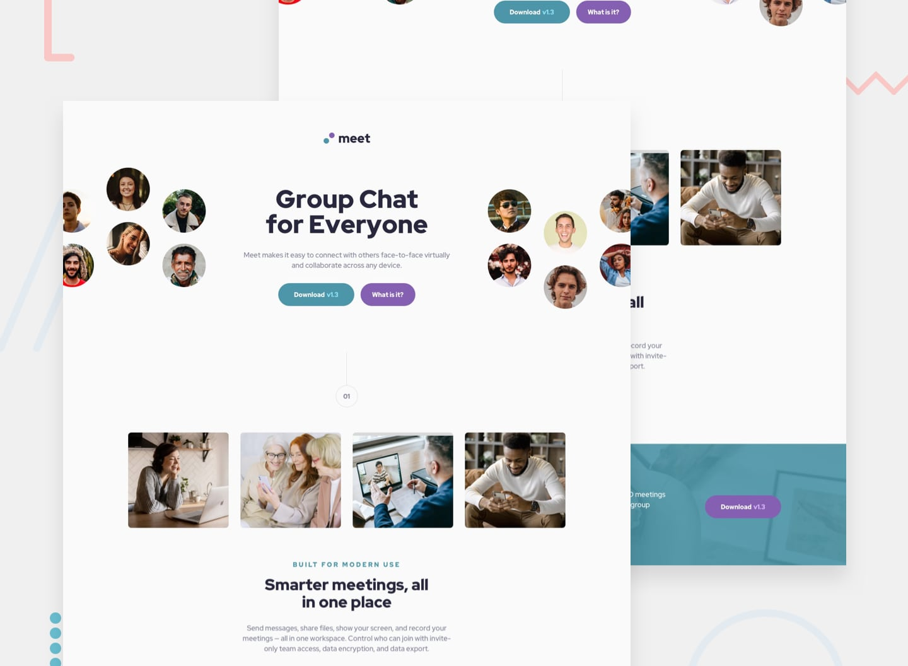

# Meet Landing Page

This is a challenge from [Frontend Mentor](https://www.frontendmentor.io/). Coded by [me](https://www.frontendmentor.io/profile/ApplePieGiraffe)! 😁

Welcome to the repository for this project. Feel free to look around and expore! 😀

### Tools

- [Svelte](https://svelte.dev/)
- [GSAP](https://greensock.com/gsap/)
- [ScrollTrigger](https://greensock.com/scrolltrigger/)
- [smooth-scrollbar](https://idiotwu.github.io/smooth-scrollbar/)

### Development

I decided to build this app using Svelte. Svelte is an awesome compiler where everything feels like it just makes sense. I already knew that I liked Svelte, but this experience made me realize that I love Svelte! 😍

Adding animations was a breeze with GSAP and ScrollTrigger. Both are great tools that make animating things fairly easy and very fun! I used smooth-scrollbar to soften the scrolling of the page and customize the appearance of the scroll bar. 😀

The only trouble I had was combining all of these tools and getting them to work together. If anyone happens to be interested in using Svelte, GSAP, ScrollTrigger, and smooth-scrollbar, here's a [GSAP forums thread](https://greensock.com/forums/topic/28165-how-to-use-scrolltriggers-scrollerproxy-in-svelte) that I created when I was really stuck that might come in useful. 🙂

### Notes

I think some things like the tablet/mobile animations and perhaps accessibility might need some tweaking. I'm always open to ideas and suggestions, so please do let me know if you have anything to say! 👍

Besides that...

Scroll past the hero section and back again to toggle between the original avatars/the avatars of some of my favorite people on Frontend Mentor! 😆

And click on the giraffe for the attribution! 😉

---

[Frontend Mentor Solution](https://www.frontendmentor.io/solutions/meet-landing-page-svelte-gsap-3r4x3DG5v)

Happy coding! 😄